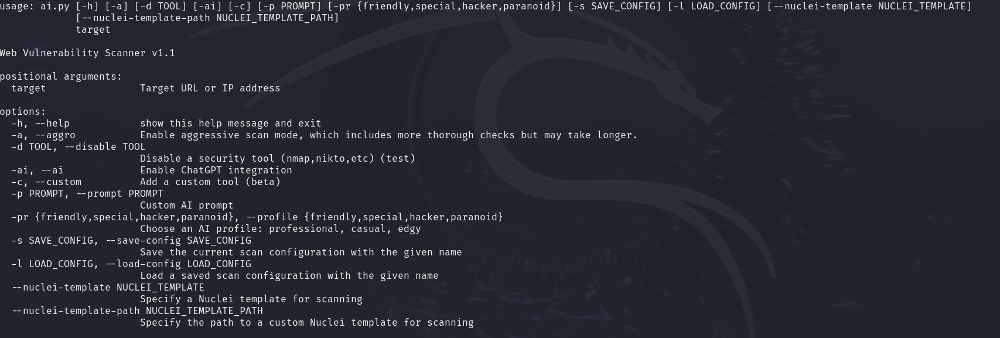
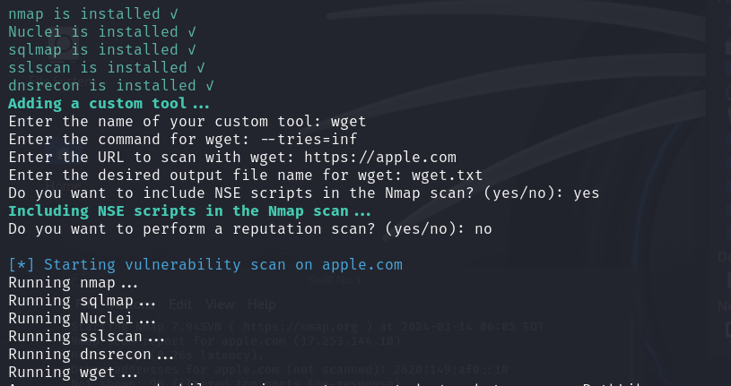
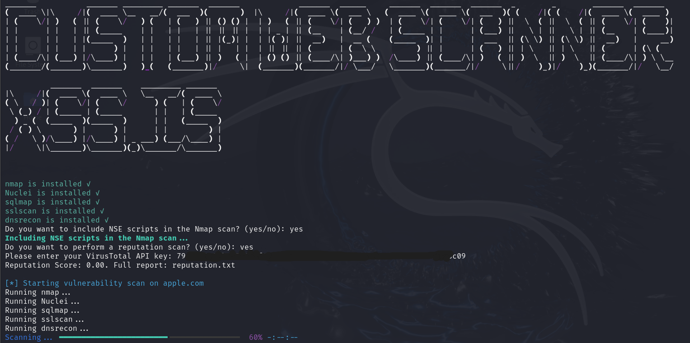
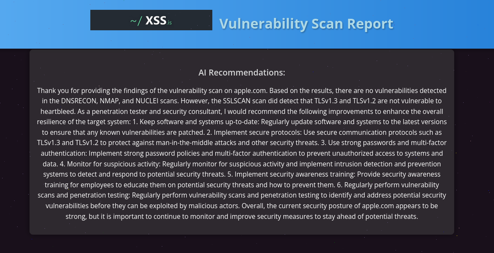
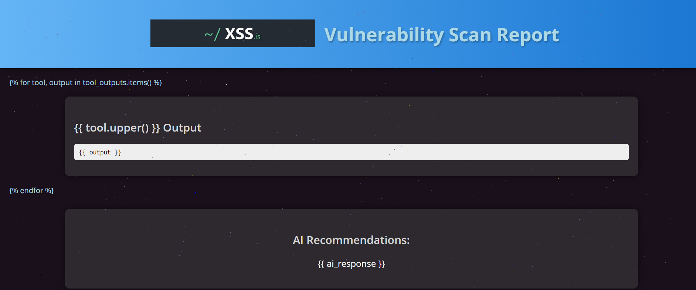

<div style="text-align:center">

# Automated Vulnerability Scanner 🛡️


## Overview 📖

</div>

The Automated Vulnerability Scanner is a comprehensive tool designed to automate the process of analyzing security vulnerabilities in web applications. It integrates popular penetration testing tools such as Nmap, Nuclei, Sqlmap, SSLScan, and DNSRecon, ensuring a thorough security testing process. The scanner is customizable, allowing users to add their own tools, change existing arguments, and select aggressive scanning modes to adapt to their specific environment.

## Key Features 🚀

### Core Features

- **AI Integration**: The project leverages AI (specifically, the Llama language model) to automate report analysis, providing valuable recommendations and advice on fixing detected vulnerabilities.
- **Customizable Tools**: Users can customize the AI profile to suit their style and needs, from a friendly mentor to a cyber-specialist or hacker-guru.
- **Extensibility**: The ability to disable or add custom tools, select aggressive scanning modes, and create custom tools to adapt to your environment.
- **Proxy Support**: The scanner supports the use of proxies for network operations (commented out by default).
- **Severity Level Determination**: The scanner automatically determines the severity level (critical, high, medium, low, or info) of detected vulnerabilities based on keywords and CVE patterns.
- **HTML Reporting**: The scanner generates a comprehensive HTML report with detailed findings, AI recommendations, and tool outputs.
- **Concurrent Execution**: The scanner utilizes concurrent execution to run multiple tools simultaneously, improving overall scanning speed.
- **Progress Tracking**: A progress bar with time remaining estimation is displayed during the scanning process.
- **Configuration Management**: Users can save and load scan configurations for future use.

## Advanced Features

- **Reputation Scanning**: The scanner can perform a reputation scan using VirusTotal to assess the reputation of the target domain or IP address before proceeding with a full scan.
- **Custom AI Profiles**: Users can choose from different AI profiles to tailor the AI's analysis and recommendations to their preferred style.
- **Custom Nuclei Templates**: Users can specify custom Nuclei templates for scanning, allowing for more targeted vulnerability assessments.
- **Concurrent Scanning**: The scanner can run multiple tools concurrently, significantly reducing the overall scanning time.
- **AI-Driven Report Analysis**: The AI can analyze the findings from the vulnerability scan and provide insights into potential attack vectors, exploitation techniques, or misconfigurations that could be exploited.

## How It Works

The scanner works by running a series of security tools against the target URL or IP address. It then collects the reports generated by these tools and uses AI to analyze the findings. The AI can be customized with different profiles to provide feedback in various styles, such as a friendly mentor or a cyber-specialist.

### Prompts

Users can provide custom prompts to guide the AI's analysis and recommendations. This allows for a more personalized and context-aware response from the AI.

### Scanning Modes

The scanner offers different scanning modes, including an aggressive mode that runs all tools with their most comprehensive settings. This mode is useful for in-depth vulnerability assessments.

### Custom Tools

Users can add their own custom tools to the scanner. This feature allows for the integration of any tool that can be run from the command line.

## Installation

To install and use the Automated Vulnerability Scanner, follow these steps:

1. Clone the repository to your local machine.
2. Install the required dependencies by running `pip install -r requirements.txt`. Also install manually the llama and colored package dependencies. In order to install ZAP run `chmod +x install_zap.sh` and `./install_zap.sh`
3. Obtain an API key from the Llama language model and save it in a `.env` file or provide it when prompted during runtime.
4. Run the scanner with the command `python ai.py <target>`, replacing `<target>` with the URL or IP address of the target web application.

## Usage

To use the scanner, simply run the `ai.py` script with the target URL or IP address as an argument. The scanner will then run the configured security tools and provide an analysis of the findings.


### Basic Launch
```python ai.py http://example.com```


### Aggressive Mode

```python ai.py http://example.com -a```


### Disabling a Specific Tool (e.g., sqlmap):

```python ai.py "http://example.com" -d sqlmap```

### Save the current scan configuration

``python ai.py 10.0.0.1 -a -ai -pr friendly -s internal_network_scan ``

###  Load a saved scan configuration
```python ai.py http://domain.example.org -l previous_config```

### AI Integration

```python ai.py http://example.com -ai```


### Running with a Custom Prompt

```python ai.py https://shop.example.com -c -p "Analyze e-commerce website vulnerabilities"```


### Adding Your Own Tool

```python ai.py "http://example.com" -c```


### Combined Analysis and AI Mode

```python ai.py http://example.com -ai -pr hacker```


### Running with AI Profile and Aggressive Mode

```python ai.py http://example.com -ai -pr paranoid -a```


## Screenshots









## API Keys

To use the AI integration, you will need an API key from Llama. It's very easy to get and will work for quite a while. For this, go here: https://www.llama-api.com/account/api-token. Log in to your account and copy the key. Free tokens are given for $5.


## Advantages

- Automation of the penetration testing process.
- Intelligent analysis of reports and recommendations for vulnerability remediation.
- Flexible settings and the ability to adapt to specific needs.

### Configuration

The scanner can be configured using command-line arguments or by loading a saved configuration. To save a configuration, use the `--save-config` argument followed by the name of the configuration. To load a saved configuration, use the `--load-config` argument followed by the name of the configuration.

### Custom Tools

To add a custom tool, use the `--custom` argument when running the scanner. You will be prompted to enter the name of your custom tool, the command to run the tool, and the desired output file name.

### Proxy Support

If you need to use a proxy for network operations, you can configure the scanner to use your proxies by uncommenting the `proxies` dictionary in the `ai.py` file and adding your proxy settings.

## Contributing 🤝

Contributions are welcome! If you have a feature request or bug report, please open an issue on GitHub. If you wish to contribute code, please fork the repository, make your changes, and submit a pull request.